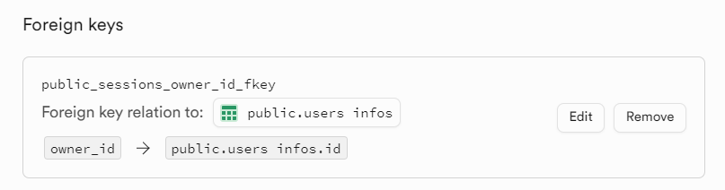

# LLM Fullstack Template

An opinionated template with a backend in Python and frontend in SvelteKit, featuring Tailwind, with a lot of features to build LLM-based state-machine like agents.

## Features

- Main blank page with a go to demo button
- Easily invite users and manage data using the Supabase dashboard
- Authentication
- Onboarding page for new users
- Compartimented and persisted user sessions
- Real-time chat with a state-machine like agent

## Screenshots

Left: login  page. Right: app page with sessions list on the left and payloads received during that session on the right.

  
  

## How it works roughly

The backend and the frontend communicate partially via http calls and mainly via websocket.

Sessions are handled on the frontend with the `useSessions` and `usePayloads` hooks which allow switching sessions and sending/receiving payloads to/from the backend withing these sessions.

Sessions are handled on the backend via states, which are persisted for later recovery in a database, alongside all the payloads sent during that session. See `backend/yourapp/example_logic/example.py`. This is where you should put your prompting/agents logic.

The backend features utilities to prompt models hosted by Anthropic, Perplexity, Groq and Mistral. Check the docstring for `ask_llm` in `backend/yourapp/llms/ask.py`.

Payloads sent by the frontend are forgotten by it immediately, but the backend sends them back once it received them, so the conversation's ground truth is given by the backend.

The backend delegates authentication partially and storage entirely to Supabase. You probably don't need to bother about it, except during setup.

## Setup

### Requirements

- node ~ 20.11
- npm ~ 10.2.4 or equivalent
- conda ~ 23.11 or equivalent

### Supabase and Database

1. Create a free tier project on [supabase](https://supabase.com/).

2. Enable login via email/password

3. Create a user, or many (without requiring email verification), assign them a password (they'll choose a new one and a username during onboarding):

4. Create a `users infos` table with these columns:

5. Create a `sessions` table with these columns:

6. Create a `sessions messages` table with these columns:

### Backend

1. Add and edit `backend/.env` with the help of `backend/.env.sample`

2. Create the environment and install the dependencies with the help of `backend/README.md`

### Frontend

1. Install the dependencies with the help of `frontend/README.md`

Note that due to dependencies optimization, the first use of the webapp after launching the dev frontend server may be super slow/irresponsive for a minute. After that hot-reloading got you covered anyway.

### Naming

Replace all `YOUR APP`, `YOURAPP`, `yourapp` and `Yourapp` strings within the codebase. Don't forget the directories' names as well.

## License

LLM Fullstack Template © 2024 by Anicet Nougaret is licensed under Creative Commons Attribution-NonCommercial-ShareAlike 4.0 International. To view a copy of this license, visit https://creativecommons.org/licenses/by-nc-sa/4.0/

*If you want a commercial use out of it, I will generally accept it once asked, and give you an enhanced license, but only if you can prove the changes you brought are significant enough.*